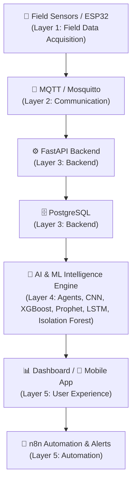

# 🌱 CropMind

### An Integrated AI Digital Operating System for Smart Agriculture in Egypt

*Unifying field telemetry, computer-vision diagnostics, predictive analytics, autonomous agents, and workflow automation into one platform.*

---

## 📑 Table of Contents

- [Overview](#-overview)
- [Key Features](#-key-features)
- [Problem Definition](#-problem-definition)
- [Motivation](#-motivation)
- [Objectives](#-objectives)
- [System Architecture](#️-system-architecture)
- [AI Agents](#-ai-agents)
- [Farm DNA Score](#-farm-dna-score)
- [Technology Stack](#-technology-stack)
- [AI/ML Methodology](#-aiml-methodology)
- [Experimental Results](#-experimental-results)
- [Automation](#️-automation)
- [Repository Structure](#-repository-structure)
- [Future Work](#-future-work)
- [Team](#-team)
- [Academic Context](#-academic-context)
- [References](#-references)
- [Project Documentation](#-project-documentation)
- [License](#-license)

---

## 🌾 Overview

**CropMind** is an integrated AI-powered digital operating system designed for smart agriculture in Egypt. Rather than relying on fragmented tools that each perform an isolated task, CropMind unifies field data, AI models, predictive analytics, autonomous agents, and workflow automation into a single platform.

The system is organized around three operational pillars:

| Pillar | Focus Areas |
|---|---|
| 🌱 **Farm** | Crop health, disease detection, IoT telemetry, water/resource monitoring |
| 💼 **Business** | Finance, inventory, workforce management, Farm DNA score |
| 📈 **Market** | Price forecasting, demand forecasting, market intelligence, sales & harvesting insights |

---

## ✨ Key Features

- 📡 **IoT Field Telemetry** — ESP32-based sensor network for real-time field data acquisition
- 👁️ **Computer Vision Diagnostics** — CNN-based plant disease classification via TensorFlow Lite
- 🧠 **Predictive Machine Learning** — Crop yield prediction, price forecasting, and demand forecasting
- 🚨 **Anomaly Detection** — Isolation Forest-based detection of sensor drift and telemetry outliers
- 🤖 **Multi-Agent Intelligence** — 7 specialized autonomous AI agents covering farm, finance, market, and workforce domains
- 🧬 **Farm DNA Score** — A composite index consolidating six operational health dimensions
- ⚙️ **Workflow Automation** — Event-driven automation via n8n for alerts and reporting
- 📱 **Dual Interfaces** — React web dashboard for managers and a React Native mobile app for field workers

---

## 🧩 Problem Definition

Existing agricultural management solutions are often fragmented. Disease detection, weather alerts, accounting, sensor monitoring, and farm management are frequently handled by separate, disconnected tools — creating data silos and forcing farm managers to switch between systems constantly.

**Key challenges addressed by CropMind:**

- Water scarcity and irrigation inefficiency
- Climate uncertainty
- Late disease detection
- Crop productivity gaps
- Agricultural market volatility
- Fragmented farm management systems

> **Central Research Problem:** The absence of an integrated, multi-agent digital operating system capable of unifying telemetry, vision diagnostics, predictive ML, finance, operations, and market intelligence in one platform.

---

## 🎯 Motivation

CropMind is motivated by real agricultural challenges in Egypt and is aligned with **Egypt Vision 2030** and the country's digital transformation direction in agriculture.

| Contextual Figure | Value |
|---|---:|
| Agriculture's contribution to Egypt's GDP | ~11.5% |
| Agriculture's share of national employment | > 28% |
| Agricultural employment in rural governorates | > 45% |
| Nile's share of renewable water supply | > 95% |
| Water loss under traditional flood irrigation | > 60% |
| Crop yield gap vs. international benchmarks | 30–40% |

Additional motivating factors include climate and environmental uncertainty, input cost inflation, fertilizer price shocks, and agricultural commodity price volatility.

---

## 🎯 Objectives

- Architect a **5-layer** agricultural digital operating system
- Implement an autonomous topology of **7 specialized AI agents**
- Develop a computer-vision pathology engine for early plant disease diagnosis
- Develop machine-learning models for yield prediction
- Implement price forecasting capabilities
- Implement demand forecasting capabilities
- Implement anomaly detection for agricultural telemetry
- Formulate the **Farm DNA Score** as a composite farm health/operational index
- Implement event-driven workflow automation using **n8n**
- Integrate farm, business, and market intelligence into one platform

---

## 🏗️ System Architecture

CropMind follows a five-layer architecture, from field-level data acquisition to user-facing automation:



### Layer Breakdown

| Layer | Name | Components |
|---|---|---|
| 1 | Field Data Acquisition | IoT sensors, ESP32 microcontrollers, field telemetry, plant images |
| 2 | Communication | MQTT, Mosquitto broker |
| 3 | Backend | Python, FastAPI, PostgreSQL |
| 4 | Intelligence Engine | AI agents, CNN, XGBoost, Prophet, LSTM, Isolation Forest |
| 5 | User Experience & Automation | React dashboard, React Native / Expo mobile app, n8n workflow automation |

---

## 🤖 AI Agents

CropMind employs **7 specialized autonomous agents**, each responsible for a distinct operational domain:

<details>
<summary><strong>View agent roles</strong></summary>

| # | Agent | High-Level Role |
|---|---|---|
| 1 | **Farm Intelligence Agent** | Monitors crop and field health signals across the farm |
| 2 | **Resource Optimization Agent** | Supports efficient use of resources such as water and inputs |
| 3 | **Finance Agent** | Supports financial intelligence for farm operations |
| 4 | **Market Intelligence Agent** | Surfaces market trends and pricing intelligence |
| 5 | **Inventory Agent** | Supports inventory tracking and management |
| 6 | **Workforce Agent** | Supports workforce coordination and management |
| 7 | **Arabic Farm Copilot** | Provides an Arabic-language conversational assistant for farm users |

</details>

---

## 🧬 Farm DNA Score

CropMind introduces a composite **Farm DNA Score** that consolidates multiple operational dimensions into a single indicator of farm health and performance.

| Dimension | Weight |
|---|---:|
| Crop Health | 22% |
| Soil Health | 20% |
| Water Efficiency | 18% |
| Operational Efficiency | 15% |
| Market Readiness | 13% |
| Risk Exposure | 12% |
| **Total** | **100%** |

---

## 🛠️ Technology Stack

<table>
<tr>
<td valign="top">

**📱 Frontend**
- React 18
- React Native
- Expo

**⚙️ Backend**
- Python 3.11
- FastAPI 0.100+

**🗄️ Database**
- PostgreSQL 15

</td>
<td valign="top">

**🤖 AI / LLM**
- LangChain
- Groq API
- Llama 3 70B
- Arabic Farm Copilot

**🧠 Machine Learning**
- XGBoost
- Prophet
- Scikit-Learn
- LSTM
- Isolation Forest

</td>
<td valign="top">

**👁️ Computer Vision**
- TensorFlow Lite 2.12
- CNN
- INT8 quantization

**📡 IoT**
- ESP32
- MQTT
- Mosquitto

**⚙️ Automation**
- n8n Community Edition

</td>
</tr>
</table>

> **Note:** The repository also contains code in Python, JavaScript, C++, PL/SQL, Batch, and Shell. Not every language listed is part of the core AI pipeline — some support infrastructure, tooling, or scripting.

---

## 🧠 AI/ML Methodology

### A. Plant Disease Detection
- CNN-based plant disease classification
- Deployed via TensorFlow Lite with INT8 quantization
- 23-class classification on the PlantVillage dataset (34,500 images)
- **Result:** 94% accuracy (baseline target: 85%)

### B. Crop Yield Prediction
- **Model:** XGBoost gradient-boosted ensemble regression
- **Features:** Soil NPK, soil moisture, weather features
- **Result:** R² = 0.91

### C. Price Forecasting
- **Approach:** Prophet additive trend/seasonality model, hybridized with LSTM for short-term residuals
- **Result:** Mean Absolute Error (MAE) below 10%

### D. Anomaly Detection
- **Model:** Isolation Forest
- **Purpose:** Detect sensor drift, telemetry outliers, and support real-time anomaly detection

### E. Demand Forecasting
- Gradient boosting-based demand forecasting models
- Available model examples: Maize, Tomato, Onion, Potato

---

## 📊 Experimental Results

| Component | Model / Method | Result |
|---|---|---|
| Plant Disease Classification | CNN / TensorFlow Lite | 94% accuracy |
| Crop Yield Regression | XGBoost | R² = 0.91 |
| Price Forecasting | Prophet + LSTM | MAE < 10% |
| Anomaly Detection | Isolation Forest | Real-time sensor anomaly detection |
| Farm DNA Score | Weighted composite index | 84% demonstration score |
| Event Automation | n8n workflows | 100% workflow trigger success |

---

## ⚙️ Automation

CropMind uses **n8n Community Edition** for event-driven workflow orchestration, with 5 defined workflows:

1. Daily Health Check
2. Weather Alert
3. Disease Outbreak
4. Price Spike
5. Weekly Report

| Metric | Value |
|---|---|
| Workflow trigger success rate | 100% |
| Weather Alert latency | 0.8 seconds |
| Weekly Report latency | 2.4 seconds |

---

## 📁 Repository Structure

```
CropMind/
├── ai_engine/            # AI agent logic
├── computer_vision/      # Plant disease classification models & assets
├── docs/                 # Documentation and notebooks
├── frontend/             # React web dashboard
├── infrastructure/       # Infrastructure-related configuration
├── iot/                  # ESP32 / IoT telemetry code
├── ml_models/            # Trained ML model artifacts (yield, price, demand, anomaly)
├── mobile/               # React Native / Expo mobile application
├── .gitignore
├── LICENSE
├── run_backend.bat
├── run_frontend.bat
└── start.bat
```

<details>
<summary><strong>📦 Notable ML/CV Artifacts</strong></summary>

**Yield Prediction**
- `ml_models/yield_prediction/yield_model.pkl`

**Computer Vision**
- `computer_vision/models/model_unquant.tflite`

**Anomaly Detection**
- `ml_models/anomaly_detection/models/anomaly_detector.pkl`

**Demand Forecasting**
- `ml_models/demand_forecasting/models/Maize_gbm.pkl`
- `ml_models/demand_forecasting/models/Tomato_gbm.pkl`
- `ml_models/demand_forecasting/models/Onion_gbm.pkl`
- `ml_models/demand_forecasting/models/Potato_gbm.pkl`

**Price Forecasting**
- `ml_models/price_forecasting/models/Tomato_lstm.h5`
- `ml_models/price_forecasting/models/Onion_lstm.h5`
- `ml_models/price_forecasting/models/Brinjal_prophet.pkl`
- `ml_models/price_forecasting/models/Wheat_prophet.pkl`
- `ml_models/price_forecasting/models/Potato_prophet.pkl`

**Forecast Outputs**
- `Brinjal_forecast.png`
- `Wheat_forecast.png`
- `Tomato_forecast.png`
- `Potato_forecast.png`
- `Onion_forecast.png`

**Documentation / Notebooks**
- `docs/demand_forecasting_models.ipynb`

</details>

---

## 🔭 Future Work

> The following items are **proposed future directions** and are **not** currently implemented features.

- Egyptian crop pathology dataset with 100,000+ images captured under natural sunlight
- Graph Neural Network (GNN) spatial yield estimation across Nile Delta governorates
- Transformer-based time-series architectures for commodity price forecasting
- Longitudinal Farm DNA validation across multi-season commercial field trials
- Hands-free Arabic speech recognition
- Offline LLM quantization for field workers
- Zero-trust cybersecurity framework for smart-farm telemetry networks

---

## 📖 References

1. Egyptian Government, "Egypt Vision 2030: Sustainable Development Strategy – Agricultural Pillar," Ministry of Planning, 2016.
2. D. P. Hughes and M. Salathé, "An open access repository of images on plant health," arXiv:1511.08060, 2015.
3. T. Chen and C. Guestrin, "XGBoost: A scalable tree boosting system," ACM SIGKDD, 2016.
4. S. J. Taylor and B. Letham, "Forecasting at scale," The American Statistician, vol. 72, 2018.
5. F. T. Liu, K. M. Ting, and Z.-H. Zhou, "Isolation forest," IEEE ICDM, 2008.
6. S. Wolfert, L. Ge, C. Verdouw, and M.-J. Bogaardt, "Big data in smart farming – A review," Agricultural Systems, 2017.
7. S. Yao et al., "ReAct: Synergizing reasoning and acting in language models," ICLR, 2023.
8. H. Chase, "LangChain: Building applications with LLMs through composability," 2022.
9. World Bank, "Egypt Economic Monitor: Strengthening Resource Allocation," 2022.
10. M. S. Farooq et al., "A survey on IoT-based smart agriculture technologies," IEEE Access, 2019.

> The full reference list of 40 sources is available in the accompanying thesis document.

---

## 📚 Project Documentation

- [CropMind Thesis / Supporting Document 1](https://drive.google.com/file/d/1BNeuJdiG533Gk9O-A25fs2bO5AF7sVtl/view)
- [CropMind Thesis / Supporting Document 2](https://drive.google.com/file/d/1BrooaRU1-t4FO9WVyn6XrzOW6vx5CEO7/view)

---

## 📄 License

This project is licensed under the **MIT License**.
